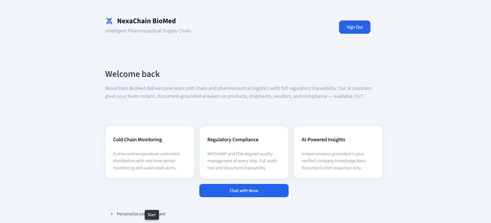
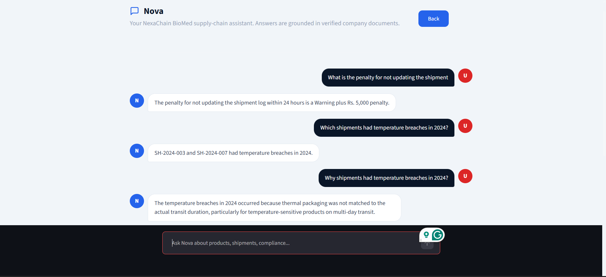
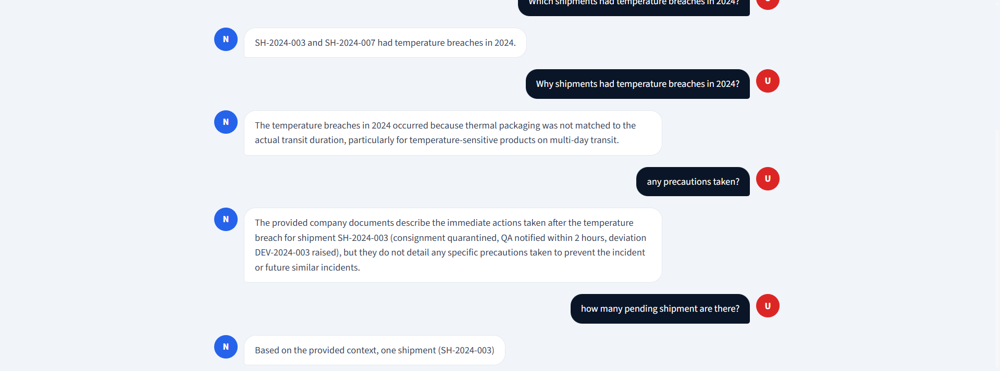

# Shipment Intelligence RAG

**Author:** aryanwaingankar4  
**Repository:** shipment-intelligence-rag  
**Stack:** Python, Google Colab, ChromaDB, Sentence Transformers, Gemini 2.5 Flash, Streamlit, ngrok

---

## What This Project Does

Shipment Intelligence RAG is a document-grounded question-answering system built for pharmaceutical supply chain operations. It ingests internal company documents (product manuals, compliance guides, shipment logs, vendor records, and incident reports), converts them into a searchable vector database, and lets users ask natural language questions. Every answer is generated strictly from the retrieved documents — the system never uses outside knowledge.

The frontend is a Streamlit web application deployed via ngrok from Google Colab. It includes login authentication, a branded dashboard, and a chat interface powered by an AI assistant named Nova.

---

## Architecture

The pipeline follows a classic RAG (Retrieval-Augmented Generation) pattern across three phases — document ingestion, retrieval, and generation — stitched together with a two-stage retrieve-and-rerank strategy.

```
[Source Documents (.txt)]
        |
        v
[Structure-Aware Chunker]       <-- splits on === HEADER === markers
        |
        v
[Sentence Transformer Encoder]  <-- all-MiniLM-L6-v2, 384-dim
        |
        v
[ChromaDB Vector Store]         <-- persisted to Google Drive, cosine space
        |
        v
[User Question]
   |
   v
[Bi-Encoder Retrieval]          <-- top-8 candidates via ChromaDB cosine search
   |
   v
[Cross-Encoder Reranker]        <-- ms-marco-MiniLM-L-6-v2, top-3 selected
   |
   v
[Grounded Prompt Builder]       <-- context + system instructions + question
   |
   v
[Gemini 2.5 Flash]              <-- temperature 0.1, max 512 tokens
   |
   v
[Answer]  +  [Query Log CSV]
   |
   v
[Streamlit Chat UI]
```

---

## Screenshots

### Home / Dashboard


### Chat Interface




---

## Project Structure

```
RAG PROJECT/
├── docs/
│   ├── product_manual.txt          # 5 product specifications
│   ├── compliance_guide.txt        # GDP compliance rules (6 sections)
│   ├── shipment_log.txt            # FY2024 shipment records (10 entries)
│   ├── vendor_list.txt             # 4 vendors + escalation matrix
│   └── incident_report_2024.txt    # Root cause analysis of 2 breaches
├── chroma_db/                      # Persisted vector index (Drive)
├── query_logs.csv                  # Logged queries with latency + sources
└── app.py                          # Streamlit frontend
```

---

## Day-by-Day Build Log

### Day 1 — Documents and Folder Setup

The project begins by mounting Google Drive and creating the base folder structure under `RAG PROJECT/docs/`. Three mock pharmaceutical documents are written to disk:

- `product_manual.txt` — three products (TL-COLD-9001, TL-DRY-4402, TL-FROZ-7700) with storage conditions, packaging, shelf life, and excursion rules.
- `compliance_guide.txt` — six sections covering shipment documentation, temperature monitoring thresholds, warehouse rules, delay protocols, returns/recalls, and financial penalties.
- `shipment_log.txt` — seven shipment records with statuses (DELIVERED, QUARANTINED, REJECTED, DELAYED), temperature readings, and acceptance details.

A validation check confirms all three required files are present before proceeding.

---

### Day 2 — Ingestion Pipeline (Chunking, Embedding, Indexing)

**Document Expansion**

Five richer documents replace the Day 1 versions. Each uses `=== SECTION HEADER ===` formatting to enable structure-aware splitting:

| File | Content |
|------|---------|
| `product_manual.txt` | 5 products including TL-COLD-9015 (vaccine) and TL-DRY-4410 (ORS sachet) |
| `compliance_guide.txt` | Full GDP guide with added detail per section |
| `shipment_log.txt` | 10 shipments, breach rate updated to 20% |
| `vendor_list.txt` | MedSupply, Deccan Pharma, ArcticLine, SafeMove with SLAs and ratings |
| `incident_report_2024.txt` | Root cause analysis for SH-2024-003 and SH-2024-007 with CAPA actions |

**Chunking (Cell A)**

A structure-aware chunker splits each document on `===` header markers first, keeping each product or section intact as a unit. Sections longer than 700 characters are sub-split using `RecursiveCharacterTextSplitter` with 80-character overlap. Each chunk receives rich metadata:

- `source` — filename
- `doc_name` — filename without extension
- `section_name` — the header the chunk belongs to
- `chunk_id` / `chunk_total` — position within the document
- `word_count` / `char_count` — size metrics
- `keywords` — top-6 keywords extracted by frequency (stopwords filtered)

**Embedding (Cell 5)**

All chunks are encoded using `all-MiniLM-L6-v2` from Sentence Transformers. Embeddings are normalized so that dot product equals cosine similarity. A quality check queries the index with a test question and prints the top-3 cosine similarity scores to confirm the model is working.

**Indexing and Deduplication (Cell 6)**

Before storage, chunks are deduplicated by MD5 hash of their text. The ChromaDB `PersistentClient` stores the collection to `chroma_db/` on Google Drive so it survives Colab session restarts. The collection uses cosine distance (`hnsw:space: cosine`). Chunks are stored in batches of 50.

A verification report prints per-document chunk counts, average/min/max chunk sizes, and nearest-neighbour cosine scores to assess index health.

**Retrieval Test (Cell 7)**

Eight targeted questions are run against the index. Each question has a set of expected keywords. A PASS is recorded when any of the top-3 chunks contains an expected keyword. The score is printed as a percentage with a verdict (Excellent / Acceptable / Needs tuning).

**Reranker (Cells 8 and 9)**

A `CrossEncoder` (`ms-marco-MiniLM-L-6-v2`) is loaded as a second-stage reranker. The `retrieve_and_rerank()` function:

1. Fetches the top-8 candidates from ChromaDB using the bi-encoder (fast recall).
2. Scores each candidate pair `[question, chunk]` with the cross-encoder (precision).
3. Returns the top-3 after reranking.

The function returns structured dicts with `text`, `source`, `section`, `embed_score`, and `rerank_score`.

**Query Logging (Cell 10)**

`log_query()` appends each query to `query_logs.csv` with a canonical 7-column schema:

| Column | Description |
|--------|-------------|
| `timestamp` | When the query ran |
| `question` | User question |
| `answer` | Model answer (newlines flattened) |
| `sources` | Unique source filenames |
| `rerank_scores` | Cross-encoder scores |
| `num_chunks` | Chunks fed to the LLM |
| `response_time_s` | End-to-end latency in seconds |

If the CSV exists with a mismatched schema, it is backed up automatically and a fresh file is created.

---

### Day 3 — Gemini Integration, Evaluation, and Streamlit App

**Session Restore (Cell D3-1)**

A single cell reinstalls all pip packages, remounts Drive, reloads the embedding model and ChromaDB collection, restores the reranker, and redefines `retrieve_and_rerank()` and `log_query()`. This is necessary because Colab resets the runtime environment between sessions.

**Gemini API Setup (Cell D3-2)**

The Gemini API key is loaded from Colab Secrets (`GEMINI_API_KEY`). The model used is `gemini-2.5-flash`. A live test call (`"Reply with exactly: OK"`) confirms the key is valid and the model is reachable. Error classification distinguishes quota errors (429), auth errors (401/403), and model-not-found errors (404).

**RAG Query Function (Cell D3-3)**

`query_rag(question)` is the main pipeline function:

1. Calls `retrieve_and_rerank()` to fetch the top-3 reranked chunks.
2. Assembles a grounded prompt with a strict system instruction: answer only from context; if the answer is absent, return a fixed refusal string.
3. Calls Gemini with `temperature=0.1` and `max_output_tokens=512`.
4. Uses `_generate_with_retry()` with exponential backoff (5, 10, 20, 40 seconds) for transient errors (rate limits, connection resets).
5. Calls `log_query()` to persist the result.
6. Returns `(answer, sources, chunks)`.

The refusal string is:

> "I don't have enough information in the provided documents to answer this question."

**Evaluation Suite (Cell D3-4)**

Three representative tests are run with pacing (4 seconds between calls) to preserve Gemini free-tier quota:

| Test | Type | Expected |
|------|------|----------|
| Storage temperature for TL-COLD-9001 | Answer | "2" and "8" in response |
| Shipments with temperature breaches | Answer | "sh-2024-003" and "sh-2024-007" |
| Capital of France | Refuse | Exact refusal string |

Results are displayed in a pandas DataFrame with PASS / FAIL / SKIP status per test.

**Query Log Viewer (Cell D3-5)**

Reads `query_logs.csv` from Drive and displays the last 15 entries with average response time.

**Streamlit Application (Cell D3-6)**

The app is written to `app.py` on Drive. It implements the full UI with a custom CSS design system (DM Sans font, deep navy / electric blue palette, lifted card components, contrasting chat avatars). Key pages:

- **Login** — username/password gate (demo / demo123). Styled error card on failure.
- **Home / Dashboard** — brand header, tagline, three feature cards (Cold Chain Monitoring, Regulatory Compliance, AI-Powered Insights), and a "Chat with Nova" CTA button. Includes a personalization expander to rename the assistant and set custom instructions.
- **Chat** — bubble UI with user (red avatar) and Nova (blue avatar). Calls `query_rag()` on each submission. Friendly error card shown if the model is unavailable. Clear conversation button at the bottom.

Backend resources (embedding model, ChromaDB collection, reranker, Gemini model) are cached with `@st.cache_resource` so they load once per session.

**Launch (Cell D3-7)**

Streamlit is launched on port 8501 as a background process. ngrok opens a public tunnel and prints the URL. A checklist guides testing: login, branding, personalization, correct answers, out-of-scope refusal, and sign-out.

---

## Knowledge Base

| Document | Key Content |
|----------|-------------|
| `product_manual.txt` | Storage conditions, shelf life, packaging, excursion rules for 5 products |
| `compliance_guide.txt` | GDP rules, temperature thresholds, penalties, recall procedure |
| `shipment_log.txt` | 10 FY2024 shipments with temperature data, statuses, breach summary |
| `vendor_list.txt` | 4 vendors with SLA windows, on-time rates, quality ratings |
| `incident_report_2024.txt` | Root cause analysis and CAPA for 2 temperature breach incidents |

---

## Tech Stack

| Component | Technology |
|-----------|-----------|
| Notebook environment | Google Colab |
| Document storage | Google Drive |
| Embedding model | all-MiniLM-L6-v2 (384-dim, Sentence Transformers) |
| Vector database | ChromaDB (PersistentClient, cosine space) |
| Reranker | cross-encoder/ms-marco-MiniLM-L-6-v2 |
| LLM | Gemini 2.5 Flash (google-generativeai) |
| Text splitting | LangChain RecursiveCharacterTextSplitter |
| Frontend | Streamlit |
| Tunnel | pyngrok |
| Logging | CSV via Python csv module |

---

## Installation and Setup

**1. Clone the repository**

```bash
git clone https://github.com/aryanwaingankar4/shipment-intelligence-rag.git
```

**2. Open in Google Colab**

Upload `shipment_chatbot_proj.py` to Colab or open it directly from the repository.

**3. Add secrets**

In Colab, go to the Secrets panel (key icon in the left sidebar) and add:

- `GEMINI_API_KEY` — your Google AI Studio API key (starts with `AIza`)

**4. Run all cells in order**

- Day 1 cells: create folders and write documents to Drive
- Day 2 cells: chunk, embed, index, and test retrieval
- Day 3 cells: restore session, configure Gemini, run evaluation, launch app

**5. Enter ngrok token when prompted**

Get a free token at [dashboard.ngrok.com](https://dashboard.ngrok.com/signup) and paste it when Cell D3-7 asks.

---

## Environment Variables

| Variable | Source | Description |
|----------|--------|-------------|
| `GEMINI_API_KEY` | Colab Secrets | Google Generative AI API key |
| `GEMINI_MODEL` | os.environ (optional) | Override default model; defaults to `gemini-2.5-flash` |

---

## Example Queries

```
What is the storage temperature for TL-COLD-9001?
-> 2 degrees C to 8 degrees C, below 60% relative humidity, dark conditions.

What is the shelf life of StableCap Dry Powder?
-> 36 months from the date of manufacture.

Why was shipment SH-2024-007 rejected?
-> The temperature rose above -10 degrees C during transit due to insufficient dry ice.

Within how many hours must CDSCO be notified of a recall?
-> 72 hours of a confirmed recall.

What is the capital of France?
-> I don't have enough information in the provided documents to answer this question.
```

---

## Retrieval Quality

Baseline test (8 questions, top-3 hit rate):

| Metric | Value |
|--------|-------|
| Score | 7/8 (87.5%) |
| Verdict | Excellent |
| Avg chunk size | ~420 characters |
| Embedding dim | 384 |
| Distance metric | Cosine |

---

## License

This project is for educational and demonstration purposes.

---

## Contact

For questions about the knowledge base documents, contact: quality@tracelink-biomed.com  
GitHub: [aryanwaingankar4](https://github.com/aryanwaingankar4)
